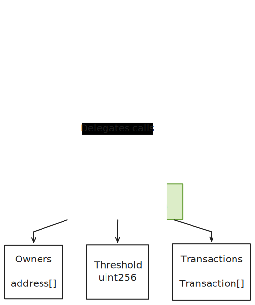

# MultiSig Wallet 🔒

Core features:

- ✨ **Configurable MultiSig wallets with custom owners and
  thresholds**

- ✅ **2/3 Confirmations** 

- 🚀 **UUPS pattern for logic updates**

# Architecture

## 📦 Proxy Contract

## 🧠 MultiSig Logic (UUPS)

# Refs
https://pkqs90.github.io/posts/gnosis-safe-walkthrough/
https://docs.openzeppelin.com/contracts/5.x/api/access#Ownable
https://docs.openzeppelin.com/contracts/5.x/api/proxy
https://docs.openzeppelin.com/contracts/5.x/api/proxy#ERC1967Utils
https://docs.openzeppelin.com/upgrades-plugins/proxies#proxy-forwarding
