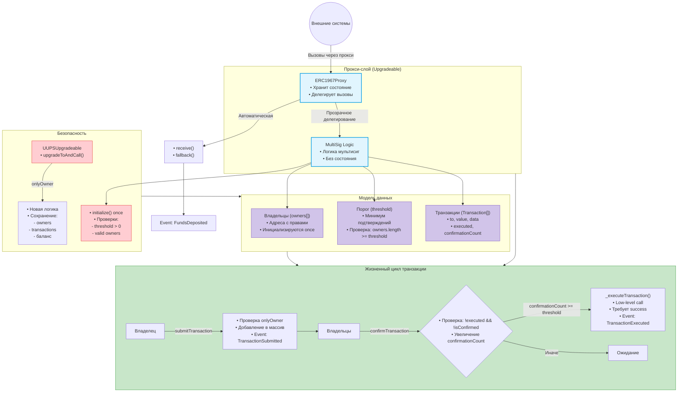

# Refs
https://pkqs90.github.io/posts/gnosis-safe-walkthrough/
https://docs.openzeppelin.com/contracts/5.x/api/access#Ownable
https://docs.openzeppelin.com/contracts/5.x/api/proxy
https://docs.openzeppelin.com/contracts/5.x/api/proxy#ERC1967Utils
https://docs.openzeppelin.com/upgrades-plugins/proxies#proxy-forwarding
